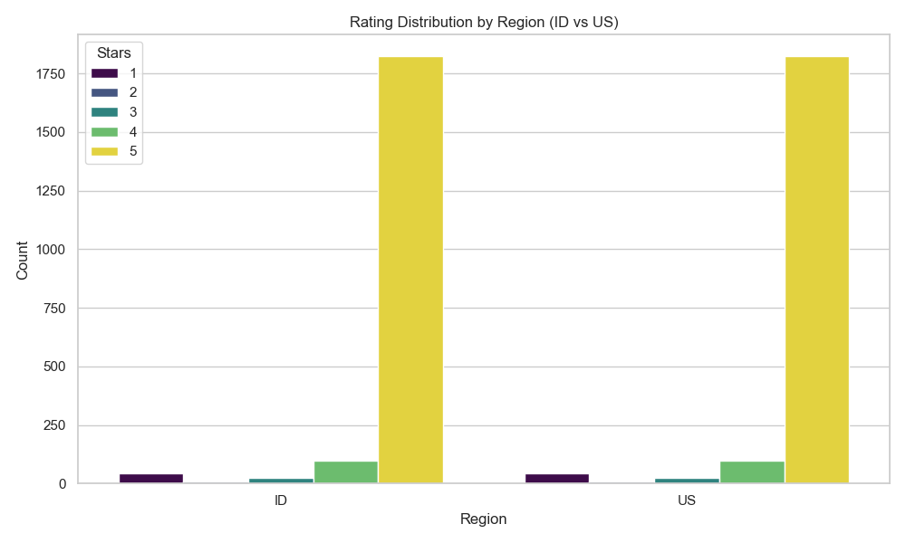
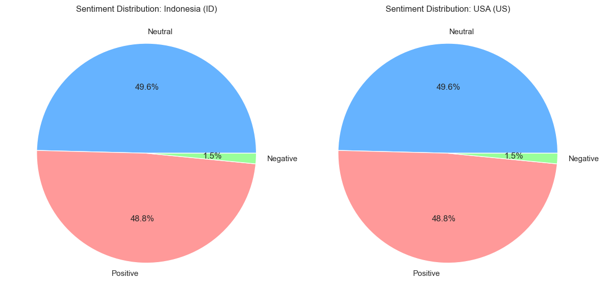

# TheoTown Review Analysis

**Proyek Latihan Data Analyst / Data Analyst Practice Project**

---

## [ID] Laporan Proyek Latihan

### Latar Belakang
Ini adalah proyek latihan pribadi saya untuk mengasah kemampuan teknis sebagai Data Analyst. Saya memilih game simulasi pembangunan kota **TheoTown** sebagai studi kasus karena memiliki komunitas pemain yang aktif dan beragam. Tujuan utama saya adalah mempraktikkan proses *end-to-end* dalam pengolahan data, mulai dari pengambilan data mentah hingga visualisasi wawasan.

### Skill & Teknologi yang Dipelajari
Dalam proyek ini, saya mempraktikkan penggunaan teknologi berikut:
*   **Python Programming**: Menggunakan library `pandas` untuk manipulasi data.
*   **Web Scraping**: Menggunakan `google-play-scraper` untuk mengambil ribuan data ulasan nyata secara otomatis.
*   **Natural Language Processing (NLP)**: Membangun logika analisis sentimen sederhana menggunakan kamus kata (Lexicon-based approach) untuk mengklasifikasikan ulasan Bahasa Indonesia dan Inggris.
*   **Data Visualization**: Membuat grafik perbandingan menggunakan `matplotlib` dan `seaborn` untuk menyampaikan temuan secara visual.

### Temuan Utama
Saya membandingkan feedback dari dua basis pemain terbesar, yaitu **Indonesia (ID)** dan **Amerika Serikat (US)**. Berikut adalah hasil latihan analisis saya:

#### 1. Perbandingan Kepuasan (Rating)
Grafik ini membandingkan distribusi bintang 1 hingga 5. Ini membantu saya memahami seberapa "keras" atau "puas" pengguna di wilayah berbeda.

#### 2. Analisis Sentimen (Positif vs Negatif)
Saya mencoba memetakan proporsi ulasan menjadi kategori Positif, Netral, dan Negatif.

#### 3. Tren Kata Kunci (Word Cloud)
Untuk memahami apa yang sebenarnya dibicarakan pemain, saya memvisualisasikan kata-kata yang paling sering muncul.

### Cara Mereproduksi Analisis
Jika Anda ingin mencoba menjalankan kode latihan ini:
1.  Pastikan Python sudah terinstal.
2.  Install dependencies: `pip install pandas matplotlib seaborn google-play-scraper wordcloud`
3.  Buka dan jalankan notebook `theotown_scraping.ipynb`.

---

## [EN] Project Report

### Background
This is a personal practice project demonstrating my technical growth as a Data Analyst. I chose **TheoTown**, a city-building simulation game, as my case study due to its active and diverse player base. My primary goal was to execute an end-to-end data analysis workflow, from raw data extraction to insight visualization.

### Skills & Technologies Applied
Throughout this project, I honed my skills in:
*   **Python Programming**: Leveraging `pandas` for efficient data manipulation.
*   **Web Scraping**: Automating the collection of thousands of real user reviews using `google-play-scraper`.
*   **Natural Language Processing (NLP)**: implementing a lexicon-based sentiment analysis logic to classify both Indonesian and English reviews.
*   **Data Visualization**: utilizing `matplotlib` and `seaborn` to communicate comparative findings effectively.

### Key Findings
I focused on comparing feedback from two major player bases: **Indonesia (ID)** and the **United States (US)**. Below are the visualizations from my analysis:

#### 1. Satisfaction Comparison (Ratings)
This chart illustrates the distribution of 1 to 5-star ratings, helping to gauge the "generosity" or satisfaction levels across regions.

#### 2. Sentiment Analysis (Positive vs Negative)
I mapped the proportion of reviews into Positive, Neutral, and Negative categories.

#### 3. Keyword Trends (Word Cloud)
To visualize the distinct topics discussed by players in each region.

### Reproduction Steps
To run this analysis code on your local machine:
1.  Ensure Python is installed.
2.  Install dependencies: `pip install pandas matplotlib seaborn google-play-scraper wordcloud`
3.  Open and Execute the `theotown_scraping.ipynb` notebook.
